<!-- README.md is generated from README.Rmd. Please edit that file -->

# GoodFitSBM: Monte Carlo goodness-of-fit tests for Stochastic Blockmodels (SBMs)

<!--  -->
<!-- [](https://cran.r-project.org/package=lmw) [](https://cran.r-project.org/package=lmw) -->

### NEWS

GoodFitSBM (Version 0.0.1): `GoodFitSBM` comprises functionality that
performs the *goodness-of-fit* test for an **ER-SBM** as well as a
**beta-SBM** (two of the three variants of SBMs as discussed in [Karwa
et al. (2023)](https://doi.org/10.1093/jrsssb/qkad084), used for
modelling network data).

### Note

The math rendering of `README.md` is not ideal, as a result of which
most of the math notations and equations remains un-rendered, hence
`knit` the `README.Rmd`, or refer to the PDF attached as
[README.pdf](https://drive.google.com/file/d/1-mzMOdQ5zWv4uIfoegl1kTGAUPPdd00j/view?usp=sharing).

### Overview

*Stochastic blockmodels* (SBMs) contributed to the theoretical and
algorithmic developments for analyzing *network* data, which has been
facilitated by the availability of data in diverse fields like *social
sciences*, *web recommender systems*, *protein networks*, *genomics*,
and *neuroscience*. SBMs being the generalization of the Erdős-Rényi
model given by [Erdős and Rényi
(1960)](https://doi.org/10.1515/9781400841356.38) was proposed
originally in context of *social sciences* for directed and undirected
graphs, whereas now it has been vastly extended and utilized in *latent
blocks in undirected graphs*, *latent space models*, *variable degree
distribution*, *dynamically evolving networks*, etc., becoming one of
the more popular approaches to model network data in computer science,
statistics and machine learning.

[Karwa et al. (2023)](https://doi.org/10.1093/jrsssb/qkad084) addresses
a very important aspect of *model fitting* by constructing (exact)
goodness-of-fit tests (under finite-sample setting) for three variants
of SBMs respectively used for modeling network data (where model
adequacy procedures are somewhat elusive in general), viz., *Erdős-Rényi
SBM* (ER-SBM), *Additive SBM*, and *beta-SBM*, where the main idea
revolves around a *frequentist conditional goodness-of-fit test*
conditioned on a sufficient statistic ([Karwa et
al. (2023)](https://doi.org/10.1093/jrsssb/qkad084) also illustrates its
Bayesian counterpart).

### Intended Use of the package `GoodFitSBM`

Out of the three variants of the SBMs in ([Karwa et
al. (2023)](https://doi.org/10.1093/jrsssb/qkad084)) to model network
data, `GoodfitSBM` addresses goodness-of-fit test under the framework of
an **ER-SBM** and a **beta-SBM**. With a focus on *simple undirected*,
and *unweighted* networks (graphs) having *no self-loop*, the package
comprises of four functions viz., `get_mle_ERSBM()`,
`get_mle_BetaSBM()`, `goftest_ERSBM()`, `goftest_BetaSBM()`,
`graphchi_ERSBM()`, `graphchi_BetaSBM()`, `sample_a_move_ERSBM()` and
`sample_a_move_BetaSBM()` - among which `goftest_ERSBM()` and
`goftest_BetaSBM()` performs the major functionality of performing the
goodness-of-fit test for the two models respectively, in process,
obtains the value of the chi-square test statistic and the corresponding
$p-$value (using a Monte Carlo approach), after proper sampling of the
graph (a Markov move or basis) - done by the function
`sample_a_move_ERSBM()` under the ER-SBM framework and done by
`sample_a_move_BetaSBM()` under the beta-SBM framework. Computation of
the chi-square test statistic value under the ER-SBM and beta-SBM
frameworks is done by `graphchi_ERSBM()` and `graphchi_BetaSBM()`
respectively, which in turn requires the estimates (maximum likelihood
estimation (MLE) in our case) of the edge probabilities $q_{ij}$ between
block $B_i$ and block $B_j$ as, $\widehat{q}_{ij}$, which is done by the
functions `get_mle_ERSBM()` and `get_mle_BetaSBM()`.

The corresponding $p-$values obtained from `goftest_ERSBM()` and
`goftest_BetaSBM()` are further analysed to examine the extent of fit of
the ER-SBM and beta-SBM to the given network (graph) (usual rule applies
to reject the null of a good fit when, $p \leq \alpha$ at level
$0< \alpha < 1$). There are other functions collated, each performing
the required functionality in the process, see the `R` files in
[GoodFitSBM Github
Repo](https://github.com/Roy-SR-007/GoodFitSBM/tree/master/R) for
details.

### The ER-SBM, beta-SBM and Related Goodness-of-Fit (GoF) Framework

In this section, we outline the theoretical part on which the entire
package `GoodFitSBM` is based.

#### Stochastic Blockmodels (SBMs)

Consider $G$ to be a graph on $n$ nodes, $g$ being its realization. It
is assumed that, all graphs are *unweighted* and *undirected*, and there
are *no self-loops*. Therefore, the graph $G$ can also be referred to by
its $n\times n$ adjacency matrix, $\mathbf{g}$, where $g_{uv} = 1$, if
there is an edge between node $u$ and $v$ in the graph $\mathbf{g}$, and
$0$ otherwise.

An *exponential family random graph model (ERGM)* assumes that the
probability of observing a graph $\mathbf{g}$ depends only on a vector
of sufficient statistics, $T(\mathbf{g})$, i.e., the probability of
observing a given network $G=\mathbf{g}$ is,

$$
\mathbb{P}_{\theta}(G=\mathbf{g}) = \frac{exp{\langle T(\mathbf{g}), \theta\rangle}}{\psi(\theta)}
$$ where
$\psi(\theta) = \sum_{\mathbf{g}}exp(\langle T(\mathbf{g}), \theta\rangle)$
is the normalizing constant, $\theta \in \Theta$ is a vector of natural
parameters, and $T(\mathbf{g})$ is the vector of minimal sufficient
statistics for the underlying model. Let $p_{uv}$ be the probability of
an edge between node $u$ and node $v$, where it is assumed that,
$g_{uv}\sim \mbox{Bernoulli}(p_{uv})$.

A *stochastic blockmodel (SBM)* postulates that the nodes are
partitioned into $k$ blocks and the probability $p_{uv}$ depends on
their block membership, where ([Karwa et
al. (2023)](https://doi.org/10.1093/jrsssb/qkad084)) considers three
different *log-linear* parametrizations of $p_{uv}$, one of which yields
the beta-SBM.

#### The ER-SBM

The generalization of the classical Erdős-Rényi model is the Erdős-Rényi
SBM, abbreviated as ER-SBM. In this case of the stochastic blockmodel,
the probability of an edge occurring between two nodes depends *only* on
their block assignments ([Holland et
al. (1983)](https://doi.org/10.1016/0378-8733(83)90021-7)). The log-odds
of the probability of the edge $\{u, v\}$ is modeled using
$\binom{k+1}{2}$ parameters viz., $\alpha_{z(u)z(v)}$ for
$1\leq u, v\leq n$, given by,

$$
\log\bigg(\frac{p_{uv}}{1-p_{uv}}\bigg) = \alpha_{z(u)z(v)}
$$ where, if nodes $u$ and $v$ belong to blocks $i$ and $j$
respectively, i.e., $z(u) = i$ and $z(v) = j$, then the model parameter
$\alpha_{ij}$ measures the *propensities* of nodes in pairs of blocks
$(i,j)$ to be connected when $i\neq j$, and the *edge density* within
each block when $i=j$.

Define, $\pmb{Q}_{k\times k} = ((q_{ij}))$, where
$q_{ij} = e^{\alpha_{ij}}(1+e^{\alpha_{ij}})^{-1}$ denotes the
probability of an edge between a node in block $B_i$ and a node in block
$B_j$. Then, the probability of observing a graph $\mathbf{g}$ can be
given by,

$$
\mathbb{P}_{\theta}(G = \mathbf{g}\mid \mathcal{Z}) = \prod_{u,v}q^{g_{uv}}_{z(u)z(v)}(1-q_{z(u)z(v)})^{(1-g_{uv})}
$$

When $\mathcal{Z}$ (the block assignments) are known, the ER-SBM is an
exponential family model,
$\mathbb{P}_{\theta}(G=\mathbf{g}\mid \mathcal{Z} = z) \propto exp\langle T_{ER}(\mathbf{g}), \theta \rangle$,
with the natural parameter vector $\theta$ given by the upper diagonal
of the $k\times k$ symmetric matrix $((\alpha_{ij}))$ of logits of the
edge probabilities between and within blocks. The natural parameter
space is $\Theta \equiv \mathbb{R}^{\binom{k+1}{2}}$, and the sufficient
statistics $T_{ER}(\mathbf{g})$ are given by the upper diagonal elements
of the symmetric $k\times k$ matrix, where the $(i,j)-$th entry of the
matrix counts the number of edges between nodes in blocks $B_i$ and
$B_{j}$.

#### The beta-SBM

Beta-SBM is exponential family version of the degree-corrected
stochastic blockmodels suggested by [Karrer and Newman
(2011)](https://link.aps.org/doi/10.1103/PhysRevE.83.016107). The
log-linear model for the edge probabilities is parametrized by
$\binom{k+1}{2}$ block parameters $\alpha_{z(u)z(v)}$ and $n$
node-specific parameters $\beta_{u}$ for $1\leq u \leq n$, with the
log-odds of the probability of an edge $\{u,v\}$ given by,

$$
\log\bigg(\frac{p_{uv}}{1 - p_{uv}}\bigg) = \alpha_{z(u)z(v)} + \beta_{u} + \beta_{v}
$$

When $\mathcal{Z}$ (the block assignments) are known, the beta-SBM is an
exponential family model with natural parameter vector
$\theta = (\beta, \alpha)$, where $\beta = (\beta_1, \ldots, \beta_{n})$
and $\alpha$ is the vector of the upper diagonal elements of the
$k\times k$ matrix $((\alpha_{i,j}))$. The natural parameter space is
$\Theta \equiv \mathbb{R}^n \times \mathbb{R}^{\binom{k+1}{2}}$. The
vector of sufficient statistics $T_{\beta}$ contains the degree of each
node $i\in [n]$ and the number of edges between each pair of blocks
$B_{i}$ and $B_{j}$ for $1\leq i < j \leq k$.

#### Goodness-of-Fit Test for ER-SBM and beta-SBM

Let us define the goodness-of-fit test as,

$$
H_0: G \sim \mathbb{P}_{\theta}(G|\mathcal{Z})
$$ against general alternatives, where
$\mathbb{P}_{\theta}(G|\mathcal{Z})$ is a variant of the SBM with a
generic parameter vector $\theta$ and block assignment $\mathcal{Z}$ (it
is assumed that the number of blocks $k$ is fixed and known).

Considering $T(\mathbf{g})$ to be the vector of sufficient statistics in
$\mathbb{P}_{\theta}(G|\mathcal{Z})$, define a subset of the sample
space as, $F_{u} := \{\mathbf{g}:T(\mathbf{g}) = u\}$, which is the
known as the *fiber* of $u$ under the given exponential family model.

- **ER-SBM**: Let $m_{ui}$ be the number of neighbors, vertex $u$ has in
  the block $B_i$, i.e., $m_{ui} = \sum_{v\in B_i}g_{uv}$. The MLE of
  edge probabilities between blocks $B_i$ and $B_j$, i.e., $q_{ij}$’s is
  given according as ([Bickel et al. (2013), pg.
  1928](https://doi.org/10.1214/13-AOS1124)),

$$
\widehat{q}_{ij} = \begin{cases}
\frac{\sum_{u\in B_i}\sum_{v\in B_j}g_{uv}}{n_{i}n_{j}}, & i\neq j\\
\frac{\sum_{u\in B_j}\sum_{v\in B_j}g_{uv}}{n_{i}(n_i-1)}, & i = j
\end{cases}
$$

And, we define the block-corrected chi-square test statistic as,

$$
GoF_{\mathcal{Z}}(\mathbf{g}) = \chi^{2}_{\mbox{block-corrected}}(\mathbf{g}, \mathcal{Z}) = \sum_{u=1}^{n}\sum_{i=1}^{k}\frac{(m_{ui} - n_{i}\widehat{q}_{z(u)i})^2}{n_{i}\widehat{q}_{z(u)i}}
$$ Large values of $\chi^{2}_{\mbox{block-corrected}}$ indicate lack of
fit.

- **beta-SBM**: Now the usual chi-square statistic (for the
  goodness-of-fit test) is not constant on the above defined fibers of
  the beta-SBM variant. Thus, analogous to the beta-model in [Petrovic
  et al. (2010)](https://arxiv.org/abs/0909.0073), we use the Pearson’s
  chi-square statistic,

$$
GoF_{\mathcal{Z}}(\mathbf{g}) = \chi^{2}_{\mbox{beta-SBM}}(\mathbf{g}, \mathcal{Z}) = \sum_{1\leq u < v \leq n}\frac{(g_{uv} - \widehat{g}_{uv})^2}{\widehat{g}_{uv}}
$$ where,
$\widehat{g}_{uv} = exp(\widehat{\alpha}_{z(u)z(v)} + \widehat{\beta}_{u} + \widehat{\beta}_{v})/( exp(\widehat{\alpha}_{z(u)z(v)} + \widehat{\beta}_{u} + \widehat{\beta}_{v}))$,
the MLEs $\widehat{\alpha}$ and $\widehat{\beta}$ are associated with
the MLEs of the edge probabilities $q_{uv}$, as obtained in the
`get_mle_BetaSBM()` function. Large values of
$\chi^{2}_{\mbox{beta-SBM}}$ correspond to departure from the null
$(H_0)$ as stated above.

- For the algorithm of sampling of the graph (as done by
  `sample_a_move_ERSBM()` and `sample_a_move_BetaSBM()`) - or a Markov
  move (basis) - and other details, see Section 5.3 of ([Karwa et
  al. (2023)](https://doi.org/10.1093/jrsssb/qkad084)).

### Use and Related Functionalities

In this section, we highlight the installation and different
functionalities included in `GoodFitSBM` along with its implementation
on some test cases and a real-life dataset.

#### Installation

To install and load-up the package `GoodFitSBM` (version 0.0.1) from
[GoodFitSBM Github Repo](https://github.com/Roy-SR-007/GoodFitSBM), run
the following commands.

``` r
# install.packages("devtools")
# install.packages("remotes")
library(devtools)
library(remotes)
remotes::install_github("Roy-SR-007/GoodFitSBM")
```

    #> 
    #> ── R CMD build ─────────────────────────────────────────────────────────────────────────────────────────────────────────────────────────────────────────────────────────────────────────────────────────
    #>      checking for file ‘/private/var/folders/ls/s91_zt990n9b6gdbr57m19900000gn/T/RtmpRX2GCi/remotes329e4aa087f5/Roy-SR-007-GoodFitSBM-4b351f1/DESCRIPTION’ ...  ✔  checking for file ‘/private/var/folders/ls/s91_zt990n9b6gdbr57m19900000gn/T/RtmpRX2GCi/remotes329e4aa087f5/Roy-SR-007-GoodFitSBM-4b351f1/DESCRIPTION’
    #>   ─  preparing ‘GoodFitSBM’:
    #>      checking DESCRIPTION meta-information ...  ✔  checking DESCRIPTION meta-information
    #>   ─  checking for LF line-endings in source and make files and shell scripts
    #>   ─  checking for empty or unneeded directories
    #>   ─  building ‘GoodFitSBM_0.0.1.tar.gz’
    #>      
    #> 

``` r
library(GoodFitSBM)
```

To install and load-up the package `GoodFitSBM` (version 0.0.1) from
directly, run the following commands.

``` r
install.packages("GoodFitSBM")
library(GoodFitSBM)
```

#### Example 1: Sampling a Graph using `sample_a_move_ERSBM()` and `sample_a_move_BetaSBM()`

Here we consider sampling (Markov move) a graph (under the **ER-SBM**
framework) with a total of $n=150$ nodes, with $k = 3$ blocks of sizes
$50$ each.

``` r
library(igraph)
RNGkind(sample.kind = "Rounding")
set.seed(1729)

# We model a network with 3 even classes
n1 = 50
n2 = 50
n3 = 50

# Generating block assignments for each of the nodes
n = n1 + n2 + n3
class = rep(c(1, 2, 3), c(n1, n2, n3))

# Generating the adjacency matrix of the network
# Generate the matrix of connection probabilities
cmat = matrix(
  c(
    30, 0.05, 0.05,
    0.05, 30, 0.05,
    0.05, 0.05, 30
  ),
  ncol = 3,
  byrow = TRUE
)
pmat = cmat / n

# Creating the n x n adjacency matrix
adj <- matrix(0, n, n)
for (i in 2:n) {
  for (j in 1:(i - 1)) {
    p = pmat[class[i], class[j]] # We find the probability of connection with the weights
    adj[i, j] = rbinom(1, 1, p) # We include the edge with probability p
  }
}

adjsymm = adj + t(adj)

# graph from the adjacency matrix
G = igraph::graph_from_adjacency_matrix(adjsymm, mode = "undirected", weighted = NULL)

# plotting the current graph
plot(G, main = "The current graph")
```

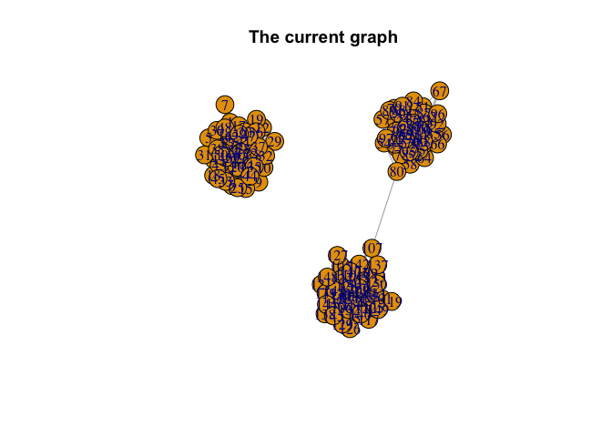

``` r
# sampling a Markov move for the ER-SBM
G_sample = sample_a_move_ERSBM(class, G)

# plotting the sampled graph
plot(G_sample, main = "The sampled graph after one Markov move for ER-SBM")
```

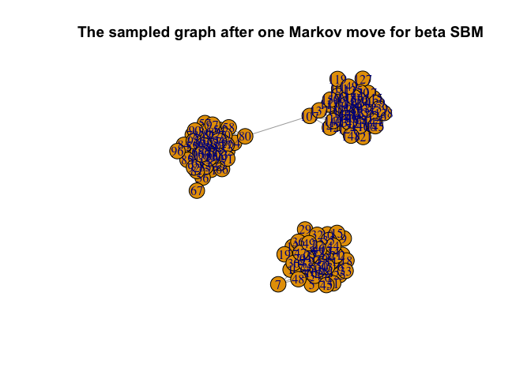

Once again, we consider sampling (Markov move) a graph (under the
**beta-SBM** framework) with a total of $n=150$ nodes, with $k = 3$
blocks of sizes $50$ each.

``` r
library(igraph)
RNGkind(sample.kind = "Rounding")
set.seed(1729)

# We model a network with 3 even classes
n1 = 50
n2 = 50
n3 = 50

# Generating block assignments for each of the nodes
n = n1 + n2 + n3
class = rep(c(1, 2, 3), c(n1, n2, n3))

# Generating the adjacency matrix of the network
# Generate the matrix of connection probabilities
cmat = matrix(
  c(
    30, 0.05, 0.05,
    0.05, 30, 0.05,
    0.05, 0.05, 30
  ),
  ncol = 3,
  byrow = TRUE
)
pmat = cmat / n

# Creating the n x n adjacency matrix
adj <- matrix(0, n, n)
for (i in 2:n) {
  for (j in 1:(i - 1)) {
    p = pmat[class[i], class[j]] # We find the probability of connection with the weights
    adj[i, j] = rbinom(1, 1, p) # We include the edge with probability p
  }
}

adjsymm = adj + t(adj)

# graph from the adjacency matrix
G = igraph::graph_from_adjacency_matrix(adjsymm, mode = "undirected", weighted = NULL)

# plotting the current graph
plot(G, main = "The current graph")
```

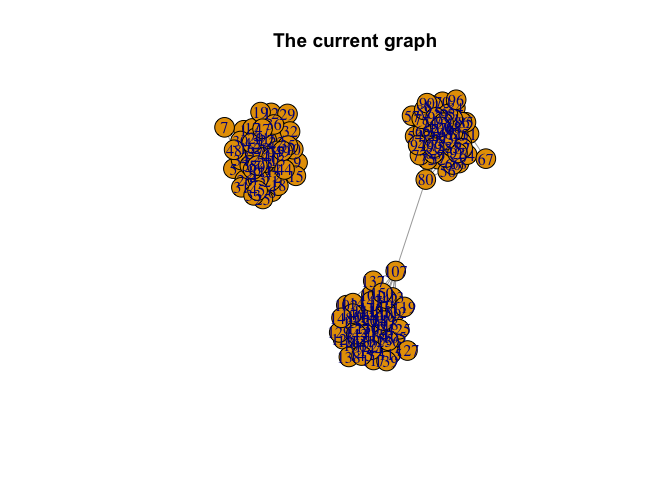

``` r
# sampling a Markov move for the beta-SBM
G_sample = sample_a_move_BetaSBM(class, G)

# plotting the sampled graph
plot(G_sample, main = "The sampled graph after one Markov move for beta-SBM")
```

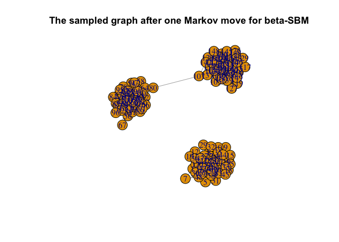

#### Example 2: Estimating Edge Probabilities using `get_mle_ERSBM()` and `get_mle_BetaSBM()`

Here we determine the MLEs of the edge probabilities
$(\widehat{q}_{uv})$ for a graph with $k=3$ blocks each of size $2$, and
having a total of $n=6$ nodes - under the **ER-SBM** as well as
**beta-SBM** framework.

``` r
library(igraph)
RNGkind(sample.kind = "Rounding")
set.seed(1729)

# We model a network with 3 even classes
n1 = 2
n2 = 2
n3 = 2

# Generating block assignments for each of the nodes
n = n1 + n2 + n3
class = rep(c(1, 2, 3), c(n1, n2, n3))

# Generating the adjacency matrix of the network
# Generate the matrix of connection probabilities
cmat = matrix(
  c(
    0.80, 0.50, 0.50,
    0.50, 0.80, 0.50,
    0.50, 0.50, 0.80
  ),
  ncol = 3,
  byrow = TRUE
)
pmat = cmat / n

# Creating the n x n adjacency matrix
adj <- matrix(0, n, n)
for (i in 2:n) {
  for (j in 1:(i - 1)) {
    p = pmat[class[i], class[j]] # We find the probability of connection with the weights
    adj[i, j] = rbinom(1, 1, p) # We include the edge with probability p
  }
}

adjsymm = adj + t(adj)

# graph from the adjacency matrix
G = igraph::graph_from_adjacency_matrix(adjsymm, mode = "undirected", weighted = NULL)

# mle of the edge probabilities

## MLE matrix in case of ER-SBM
get_mle_ERSBM(G, class) 
```

    #>      [,1] [,2] [,3]
    #> [1,]    0 0.00 0.00
    #> [2,]    0 0.00 0.25
    #> [3,]    0 0.25 0.00

``` r
## MLE matrix in case of beta-SBM
get_mle_BetaSBM(G, class)
```

    #> 2 iterations: deviation 5.551115e-16

    #>            [,1]       [,2]       [,3]       [,4]       [,5]       [,6]
    #> [1,] 0.00000000 0.00000000 0.08333333 0.08333333 0.08333333 0.08333333
    #> [2,] 0.00000000 0.00000000 0.08333333 0.08333333 0.08333333 0.08333333
    #> [3,] 0.08333333 0.08333333 0.08333333 0.08333333 0.08333333 0.08333333
    #> [4,] 0.08333333 0.08333333 0.08333333 0.08333333 0.08333333 0.08333333
    #> [5,] 0.08333333 0.08333333 0.08333333 0.08333333 0.08333333 0.08333333
    #> [6,] 0.08333333 0.08333333 0.08333333 0.08333333 0.08333333 0.08333333

#### Example 3: Computing the chi-square test statistic value using `graphchi_ERSBM()` and `graphchi_BetaSBM()`

Computing the chi-square test statistic value for a network with a total
of $n=9$ nodes, and $k=3$ blocks of size $3$ each - under the **ER-SBM**
as well as **beta-SBM** framework.

``` r
library(igraph)
RNGkind(sample.kind = "Rounding")
set.seed(1729)

# We model a network with 3 even classes
n1 = 50
n2 = 50
n3 = 50

# Generating block assignments for each of the nodes
n = n1 + n2 + n3
class = rep(c(1, 2, 3), c(n1, n2, n3))

# Generating the adjacency matrix of the network
# Generate the matrix of connection probabilities
cmat = matrix(
  c(
    30, 0.5, 0.5,
    0.5, 30, 0.5,
    0.5, 0.5, 30
  ),
  ncol = 3,
  byrow = TRUE
)
pmat = cmat / n

# Creating the n x n adjacency matrix
adj <- matrix(0, n, n)
for (i in 2:n) {
  for (j in 1:(i - 1)) {
    p = pmat[class[i], class[j]] # We find the probability of connection with the weights
    adj[i, j] = rbinom(1, 1, p) # We include the edge with probability p
  }
}

adjsymm = adj + t(adj)

# graph from the adjacency matrix
G = igraph::graph_from_adjacency_matrix(adjsymm, mode = "undirected", weighted = NULL)

# mle of the edge probabilities for the ER-SBM
p.hat.ERSBM = get_mle_ERSBM(G, class)

# mle of the edge probabilities for the beta-SBM
p.hat.BetaSBM = get_mle_BetaSBM(G, class)
```

    #> 2 iterations: deviation 1.631406e-10

``` r
# chi-square test statistic values for the ERSBM
graphchi_ERSBM(G, class, p.hat.ERSBM)
```

    #> [1] 415.8201

``` r
# chi-square test statistic values for the beta-SBM
graphchi_BetaSBM(G, class, p.hat.BetaSBM)
```

    #> [1] 3297.242

#### Main Example: `goftest()_ERSBM` and `goftest_BetaSBM()` in action

- **Instance 1**: Here we consider testing for the goodness-of-fit to
  the **ER-SBM** and **beta-SBM**, modeling a graph (network) with $k=3$
  blocks of size $50$ each, and a total of $n=150$ nodes.

``` r
library(igraph)
RNGkind(sample.kind = "Rounding")
set.seed(1729)

# We model a network with 3 even classes
n1 = 50
n2 = 50
n3 = 50

# Generating block assignments for each of the nodes
n = n1 + n2 + n3
class = rep(c(1, 2, 3), c(n1, n2, n3))

# Generating the adjacency matrix of the network
# Generate the matrix of connection probabilities
cmat = matrix(
  c(
    30, 0.05, 0.05,
    0.05, 30, 0.05,
    0.05, 0.05, 30
  ),
  ncol = 3,
  byrow = TRUE
)
pmat = cmat / n

# Creating the n x n adjacency matrix
adj <- matrix(0, n, n)
for (i in 2:n) {
  for (j in 1:(i - 1)) {
    p = pmat[class[i], class[j]] # We find the probability of connection with the weights
    adj[i, j] = rbinom(1, 1, p) # We include the edge with probability p
  }
}

adjsymm = adj + t(adj)

# When class assignment is known, for ERSBM
out.ERSBM = goftest_ERSBM(adjsymm, C = class, numGraphs = 100)

# When class assignment is known, for beta-SBM
out.BetaSBM = goftest_BetaSBM(adjsymm, C = class, numGraphs = 100)
```

    #> 2 iterations: deviation 1.580815e-10

``` r
chi_sq_seq.ERSBM = out.ERSBM$statistic
pvalue.ERSBM = out.ERSBM$p.value
print(pvalue.ERSBM) # p-value in case of the ER-SBM model
```

    #> [1] 0.66

``` r
chi_sq_seq.BetaSBM = out.BetaSBM$statistic
pvalue.BetaSBM = out.BetaSBM$p.value
print(pvalue.BetaSBM) # p-value in case of the beta-SBM model
```

    #> [1] 0.78

``` r
# Plotting histogram of the sequence of the test statistics
hist(chi_sq_seq.ERSBM, 20, xlab = "chi-square test statistics for ER-SBM", main = NULL, ylim = c(0, 30))
# adding test statistic on the observed network
abline(v = chi_sq_seq.ERSBM[1], col = "red", lwd = 5)
legend("topleft", legend = paste("observed GoF_ERSBM = ", chi_sq_seq.ERSBM[1]))
```

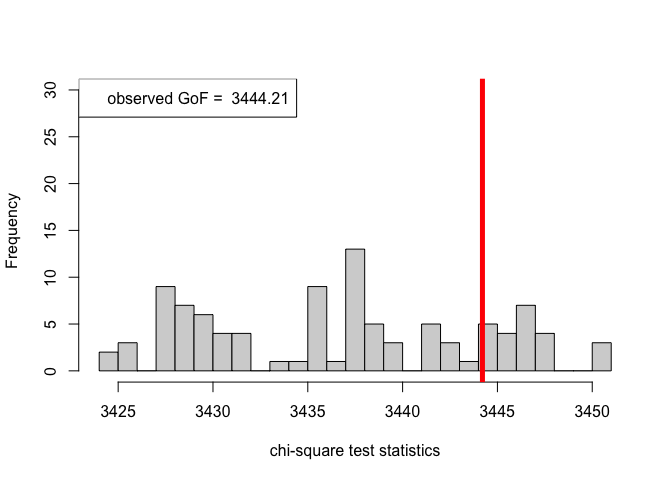

``` r
hist(chi_sq_seq.BetaSBM, 20, xlab = "chi-square test statistics for beta-SBM", main = NULL, ylim = c(0, 30))
# adding test statistic on the observed network
abline(v = chi_sq_seq.BetaSBM[1], col = "red", lwd = 5)
legend("topleft", legend = paste("observed GoF_BetaSBM = ", chi_sq_seq.BetaSBM[1]))
```

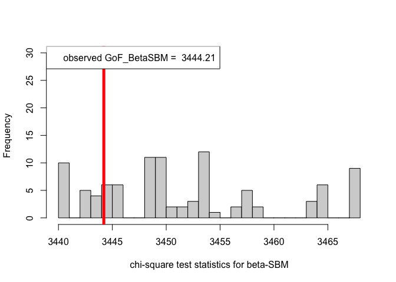

From the $p-$values obtained viz.,
$p_{\mbox{ER-SBM}}, p_{\mbox{beta-SBM}} >> \alpha = 0.05$, we fail to
reject the null of a good fit of the given (observed) network to the
ER-SBM and beta-SBM, at level $\alpha = 0.05$.

- **Instance 2**: Here we consider testing for the goodness-of-fit to
  the **ER-SBM** and **beta-SBM**, modeling a graph (network) with $k=3$
  blocks with sizes $30$, $20$, and $50$, i.e., with a total of $n=100$
  nodes.

``` r
library(igraph)
RNGkind(sample.kind = "Rounding")
set.seed(1729)

# We model a network with 3 even classes
n1 = 30
n2 = 20
n3 = 50

# Generating block assignments for each of the nodes
n = n1 + n2 + n3
class = rep(c(1, 2, 3), c(n1, n2, n3))

# Generating the adjacency matrix of the network
# Generate the matrix of connection probabilities
cmat = matrix(
  c(
    30, 0.05, 0.05,
    0.05, 30, 0.05,
    0.05, 0.05, 30
  ),
  ncol = 3,
  byrow = TRUE
)
pmat = cmat / n

# Creating the n x n adjacency matrix
adj <- matrix(0, n, n)
for (i in 2:n) {
  for (j in 1:(i - 1)) {
    p = pmat[class[i], class[j]] # We find the probability of connection with the weights
    adj[i, j] = rbinom(1, 1, p) # We include the edge with probability p
  }
}

adjsymm = adj + t(adj)

# When class assignment is known, for ER-SBM
out.ERSBM = goftest_ERSBM(adjsymm, C = class, numGraphs = 100)

# When class assignment is known, for beta-SBM
out.BetaSBM = goftest_BetaSBM(adjsymm, C = class, numGraphs = 100)
```

    #> 2 iterations: deviation 3.353762e-11

``` r
chi_sq_seq.ERSBM = out.ERSBM$statistic
pvalue.ERSBM = out.ERSBM$p.value
print(pvalue.ERSBM) # p-value in case of the ER-SBM model
```

    #> [1] 0.85

``` r
chi_sq_seq.BetaSBM = out.BetaSBM$statistic
pvalue.BetaSBM = out.BetaSBM$p.value
print(pvalue.BetaSBM) # p-value in case of the beta-SBM model
```

    #> [1] 0.04

``` r
# Plotting histogram of the sequence of the test statistics
hist(chi_sq_seq.ERSBM, 20, xlab = "chi-square test statistics for ER-SBM", main = NULL, ylim = c(0, 30))
# adding test statistic on the observed network
abline(v = chi_sq_seq.ERSBM[1], col = "red", lwd = 5)
legend("topleft", legend = paste("observed GoF_ERSBM = ", chi_sq_seq.ERSBM[1]))
```


``` r
hist(chi_sq_seq.BetaSBM, 20, xlab = "chi-square test statistics for beta-SBM", main = NULL, ylim = c(0, 30))
# adding test statistic on the observed network
abline(v = chi_sq_seq.BetaSBM[1], col = "red", lwd = 5)
legend("topleft", legend = paste("observed GoF_BetaSBM = ", chi_sq_seq.BetaSBM[1]))
```

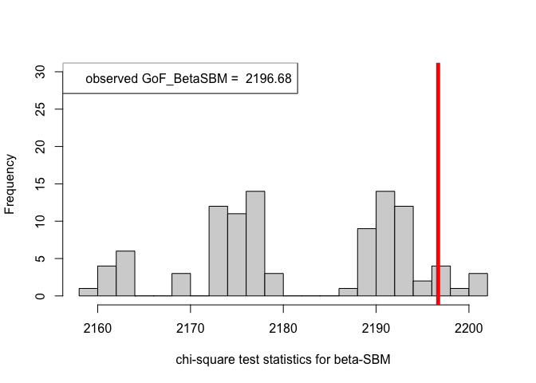

Observe that, the $p-$value obtained in case of the ER-SBM is muh higher
than $\alpha=0.05$, hence we fail to the reject the null of a good fit
of the given (observed) network to the ER-SBM, at level $\alpha = 0.05$.
Whereas, in case of the beta-SBM, the $p-$value is nominally smaller
than $\alpha=0.05$, i.e., we weakly reject the null of a good fit of the
given (observed) network to the beta-SBM.

#### Application to Real Datasets: Zachary’s Karate Club Data

*Zachary’s Karate Club Data* is a classic, well-studied social network
of friendships between 34 members of a Karate club at a US university,
collected by Wayne Zachary in 1977 ([Zachary
(1977)](http://vlado.fmf.uni-lj.si/pub/networks/data/Ucinet/UciData.htm#zachary)).

Here, we consider fitting both the **ER-SBM** and **beta-SBM** model
with $k = 2$ blocks, each with sizes $10$ and $24$ respectively, i.e., a
total of $n=34$ nodes.

``` r
library(igraph)

set.seed(334003213)

data("zachary")

d = zachary # the Zachary's Karate Club data set

# the adjacency matrix
A_zachary = as.matrix(d[1:34, ])
colnames(A_zachary) = 1:34

# obtaining the graph from the adjacency matrix above
g_zachary = igraph::graph_from_adjacency_matrix(A_zachary, mode = "undirected",
                                                weighted = NULL)

# plotting the graph (network) obtained
plot(g_zachary,
main = "Network (Graph) for the Zachary's Karate Club data set")
```

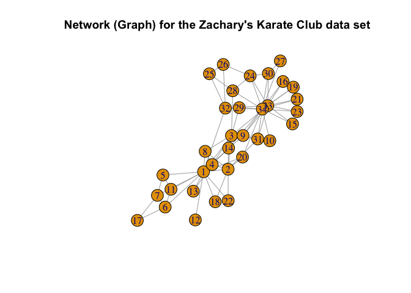

``` r
# block assignments
K = 2 # no. of blocks

n1 = 10
n2 = 24
n = n1 + n2

# known class assignments
class = rep(c(1, 2), c(n1, n2))

# goodness-of-fit tests for the Zachary's Karate Club data set, ER-SBM
out_zachary.ERSBM = goftest_ERSBM(A_zachary, C = class, numGraphs = 100)

chi_sq_seq.ERSBM = out_zachary.ERSBM$statistic
pvalue.ERSBM = out_zachary.ERSBM$p.value
print(pvalue.ERSBM)
```

    #> [1] 0.02

``` r
# goodness-of-fit tests for the Zachary's Karate Club data set, beta-SBM
out_zachary.BetaSBM = goftest_BetaSBM(A_zachary, C = class, numGraphs = 100)
```

    #> 2 iterations: deviation 3.410605e-13

``` r
chi_sq_seq.BetaSBM = out_zachary.BetaSBM$statistic
pvalue.BetaSBM = out_zachary.BetaSBM$p.value
print(pvalue.BetaSBM)
```

    #> [1] 0

``` r
# Plotting histogram of the sequence of the test statistics
hist(chi_sq_seq.ERSBM, 20, xlab = "chi-square test statistics for ER-SBM", main = NULL, ylim = c(0, 30))
# adding test statistic on the observed network
abline(v = chi_sq_seq.ERSBM[1], col = "red", lwd = 5)
legend("topleft", legend = paste("observed GoF_ERSBM = ", chi_sq_seq.ERSBM[1]))
```

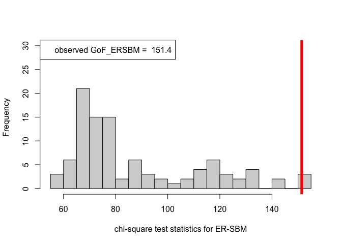

``` r
hist(chi_sq_seq.BetaSBM, 20, xlab = "chi-square test statistics for beta-SBM", main = NULL, ylim = c(0, 30))
# adding test statistic on the observed network
abline(v = chi_sq_seq.BetaSBM[1], col = "red", lwd = 5)
legend("topleft", legend = paste("observed GoF_BetaSBM = ", chi_sq_seq.BetaSBM[1]))
```

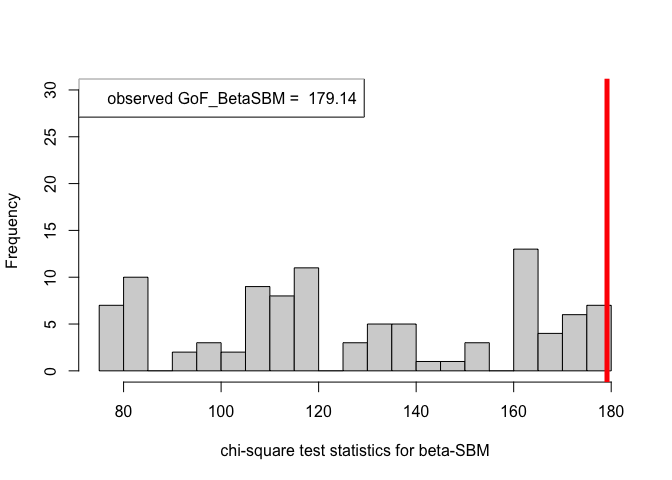

Note that, from the $p-$values obtained as well as the observed value of
the chi-square test statistic (plotted histograms) under both the
framework, i.e., ER-SBM and beta-SBM, we reject the null of a good fit,
i.e., the data (network/graph) neither fits to the ER-SBM nor to the
beta-SBM; quite similar to the lines of conclusion as claimed by ([Karwa
et al. (2023)](https://doi.org/10.1093/jrsssb/qkad084)), see Section
7.1.

#### An Addendum to Unknown Block Assignments

All of the above examples along with the instances worked-out with the
lines of code, deals with the situation where the *block assignments are
known*. On the contrary, if the block assignments $(\mathcal{Z})$ are
*unknown* (with the number of blocks always fixed and known), we refer
to ([Qin and Rohe
(2013)](https://proceedings.neurips.cc/paper_files/paper/2013/file/0ed9422357395a0d4879191c66f4faa2-Paper.pdf))
for estimating the block assignments through *regularized spectral
clustering*. See the following lines of code that is central to the
**beta-SBM** framework.

``` r
library(igraph)

set.seed(100)
# goodness-of-fit tests for the Zachary's Karate Club data set; 
# with unknown block assignments
out_zachary_unknown = goftest_ERSBM(A_zachary, K = 2, C = NULL, numGraphs = 100)

chi_sq_seq_unknown = out_zachary_unknown$statistic
pvalue_unknown = out_zachary_unknown$p.value
print(pvalue_unknown)
```

    #> [1] 0

``` r
# Plotting histogram of the sequence of the test statistics
hist(chi_sq_seq_unknown, 20, xlab = "chi-square test statistics", main = NULL, ylim = c(0, 30))
# adding test statistic on the observed network
abline(v = chi_sq_seq_unknown[1], col = "red", lwd = 5)
legend("topleft", legend = paste("observed GoF = ", chi_sq_seq_unknown[1]))
```

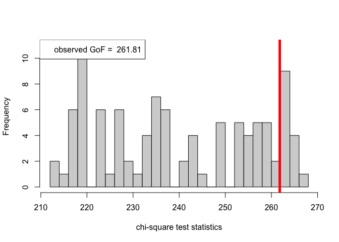

With estimation of the unknown block assignments, the $p-$value obtained
as well as the observed value of the chi-square test statistic (plotted
histogram), similar to the case as shown earlier for known block
assignments, we reject the null of a good fit, i.e., the data
(network/graph) does not fit the beta-SBM at all.

### References

- Bickel et al. (2013). “Asymptotic normality of maximum likelihood and
  its variational approximation for stochastic blockmodels”, *The Annals
  of Statistics*, <https://doi.org/10.1214/13-AOS1124>.
- Holland et al. (1983). “Stochastic blockmodels: First steps”, *Social
  Networks*, <https://doi.org/10.1016/0378-8733(83)90021-7>.
- Karwa et al. (2023). “Monte Carlo goodness-of-fit tests for degree
  corrected and related stochastic blockmodels”, *Journal of the Royal
  Statistical Society Series B: Statistical Methodology*,
  <https://doi.org/10.1093/jrsssb/qkad084>.
- Lei, J., & Rinaldo, A. (2015). “Consistency of spectral clustering in
  stochastic block models”, *The Annals of Statistics*,
  <https://doi.org/10.1214/14-AOS1274>.
- Li, T., Levina, E., & Zhu, J. (2021). “randnet: Random Network Model
  Estimation, Selection and Parameter Tuning”, *R packageversion 0.3*,
  <https://CRAN.R-project.org/package=randnet>.
- Qin, T., and Rohe, K. (2013). “Regularized spectral clustering under
  the degree-corrected stochastic blockmodel”, *Advances in neural
  information processing systems*,
  <https://proceedings.neurips.cc/paper_files/paper/2013/file/0ed9422357395a0d4879191c66f4faa2-Paper.pdf>.
